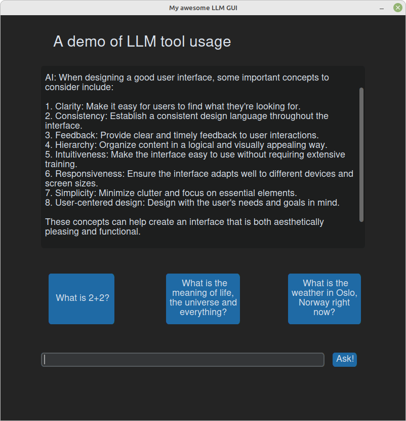

## A demo of a LLM using tools and APIs to augment responses



### Getting started

##### Before you begin

This setup guide assumes that you already have a working Python3 environment and that you have `pip3` installed. If this is not the case, refer to your OS specific installation guides first.

##### Install the required packages

```bash
pip3 install -r requirements.txt
```

##### (Optional) Create a virtual environment

To avoid installing many libraries system wide it is often a good idea to create a virtual enviroment for each project. Using `virtualenv` this can be acomplished as follows:

```bash
sudo apt install virtualenv # Assumes Ubuntu/Debian derivative distro
virtualenv .env
source .env/bin/activate
```

##### Run the application

Use the following command to run the application:

```bash
python3 gui.py
```

### Future work

- Improve responsiveness by enabling token streaming
- Handle edge case where chat history exceeds 4096 tokens causing tool_chain to fail
